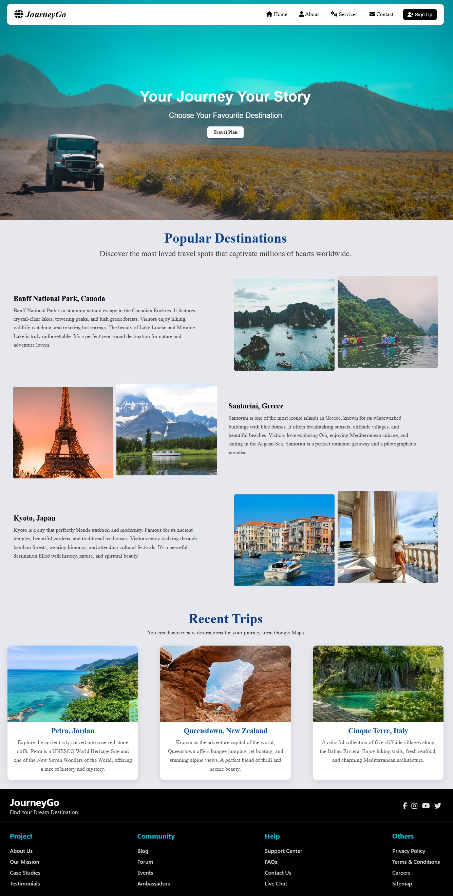
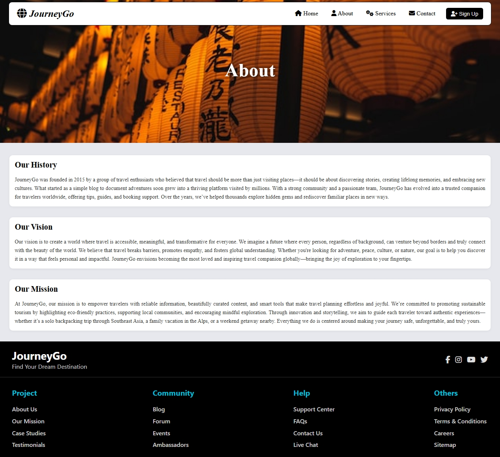
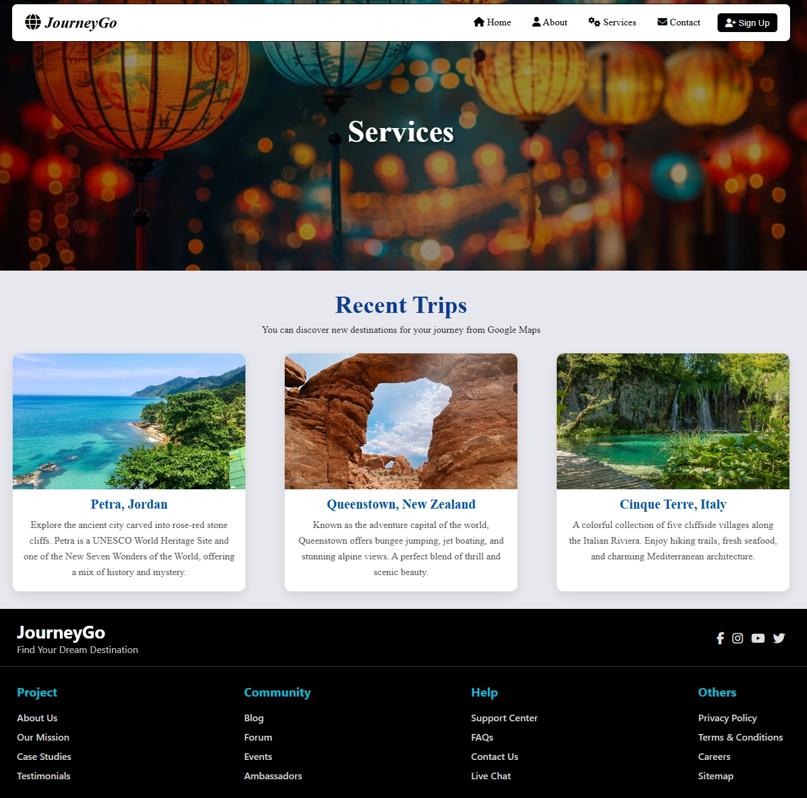
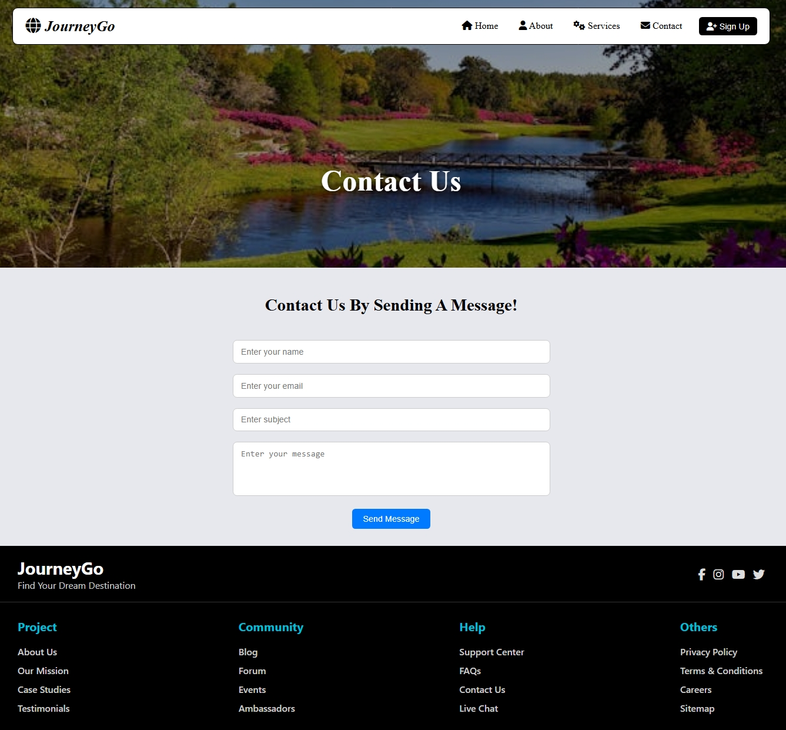

# 🌍 Travel Web App

**Travel Web App** is a sleek and responsive travel booking platform built using **React.js**. It allows users to explore top destinations, read about the agency’s story, view available services, and get in touch through a fully styled contact form.

> ✈️ *"Find Your Dream Destination."*

🌐 **Live Demo**: [https://travel-web-app-eight.vercel.app](https://travel-web-app-eight.vercel.app)

---

## 🚀 Key Features

- 🎥 Hero section with video/image background  
- 📍 Popular destinations listing  
- 📄 About us page with story and visuals  
- 🧳 Services page (tours, transport, etc.)  
- 📞 Contact form section with input fields  
- 🌐 Footer with social media links  
- 📱 Mobile-friendly responsive layout  
- ⚙️ React Router DOM for SPA navigation  
- 🔧 Reusable layout components (`Navbar`, `Footer`, `Outlet`)  

---

## 📸 Screenshots

### 🏠 Home Page  


### 🧾 About Us  


### 🧳 Services  


### 📞 Contact Page  


---

## 🧱 Folder Structure

```

Travel-Web-App/
├── public/
│   └── index.html
├── src/
│   ├── assets/          # Images and videos
│   ├── components/      # Reusable UI components
│   ├── pages/           # Main route pages (Home, About, Contact, etc.)
│   ├── Layout/          # Navbar, Footer, and Layout wrapper (with <Outlet />)
│   ├── App.js           # Main app and routes
│   ├── index.js         # Entry point
│   └── App.css          # Global styles


## 🛠️ Getting Started Locally

1. **Clone the repository**
   ```bash
   git clone https://github.com/M-Abdullah-Ali-2468/Travel-Web-App.git
   cd Travel-Web-App
````

2. **Install dependencies**

   ```bash
   npm install
   ```

3. **Run the development server**

   ```bash
   npm start
   ```

4. Open your browser and go to:
   [http://localhost:3000](http://localhost:3000)

---

## 💻 Tech Stack

| Tool/Library         | Purpose                  |
| -------------------- | ------------------------ |
| **React.js**         | Component-based frontend |
| **React Router DOM** | Routing between pages    |
| **CSS3**             | Styling                  |
| **Vercel**           | Deployment               |
| **GitHub**           | Version Control          |

---

## 🧩 Layout System

This app uses a centralized layout structure located in `src/Layout/`:

* ✅ `Navbar.jsx` – Navigation bar across pages
* ✅ `Footer.jsx` – Footer with contact/social links
* ✅ `Layout.jsx` – Wraps all pages using `<Outlet />` from `react-router-dom`

---

## 🚧 Future Improvements

* 🔐 User login/signup system
* 📦 Backend API integration (Node.js / Firebase)
* 🗓️ Booking system for tours
* 🌍 Multi-language support
* 🧑‍💼 Admin dashboard for content/tour management

---

## 🤝 Connect with Me

* 🔗 **GitHub**: [@M-Abdullah-Ali-2468](https://github.com/M-Abdullah-Ali-2468)
* 📧 **Email**: [mabdullahali8642@gmail.com](mailto:mabdullahali8642@gmail.com)

---

> ⚡ *Built with passion using React.js, styled with care, and deployed via Vercel.*


---

### 📌 Instructions

✅ Copy this entire markdown and paste it into your `README.md` file  
✅ Replace `youremail@example.com` with your real email  
✅ Make sure your image filenames and paths match exactly (case-sensitive)

